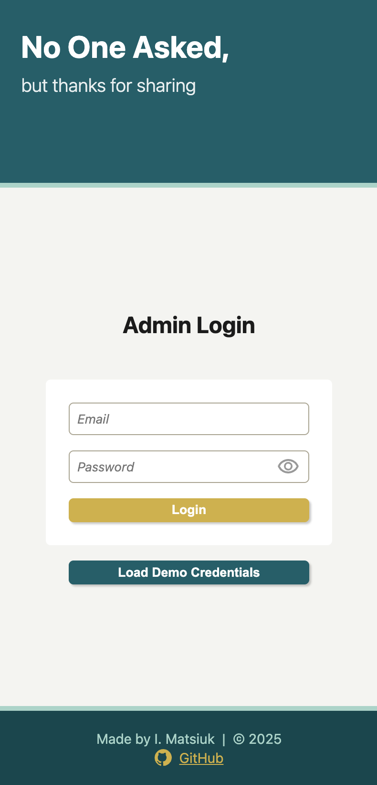
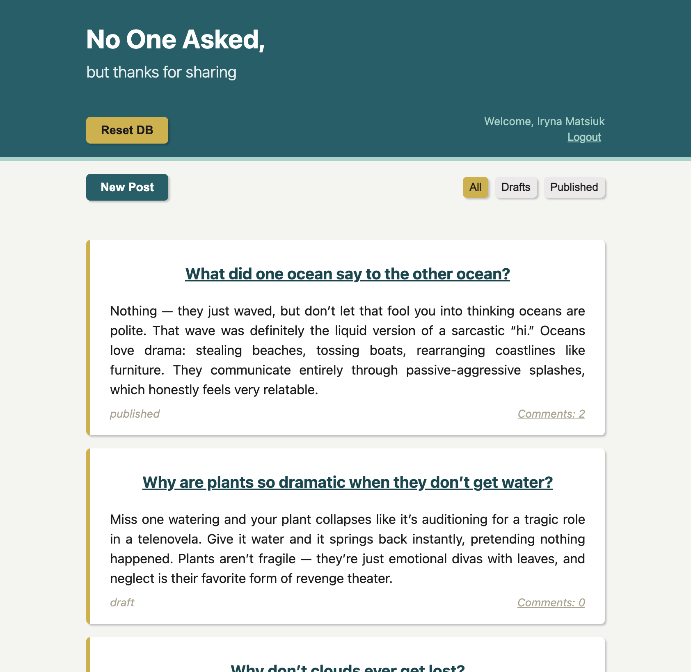
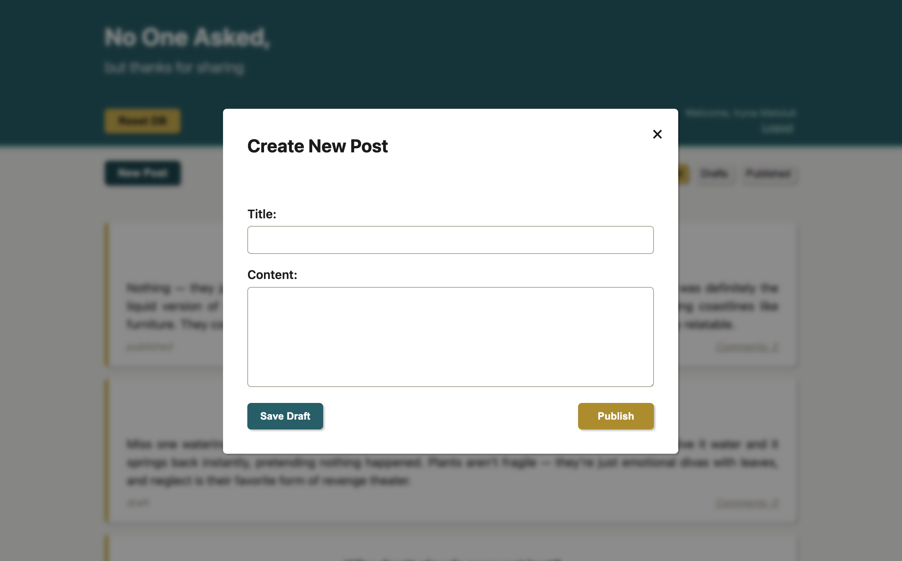
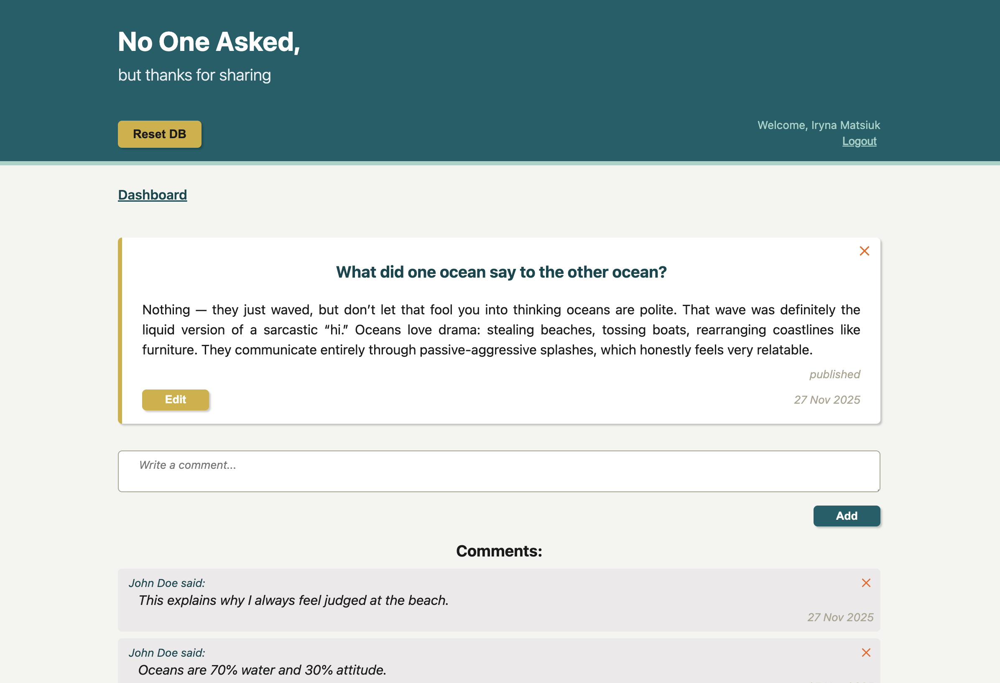

# No One Asked – Admin Front-End

Admin front-end for the **No One Asked** blog project.  
This interface allows authenticated administrator to manage posts and comments through a simple UI built with **vanilla JavaScript** and **CSS**.

Admin Front-End is just one part of the complex blog project (the Odin Project curriculum) that consists of 3 parts (projects):

1. [Backend (Node.js / Express API)](https://github.com/irynamatsiuk/irynamatsiuk.github.io/tree/main/projects/blognooneasked/backend)
2. Admin Front-End <- this repository
3. Public/user Front-End (in development)

Organizing a project this way can be beneficial because it allows the project to be more modular instead of combining business logic with view logic. This also allows to use a single backend source for multiple frontend applications, such as a website, a desktop app, or a mobile app.

Live: [No One Asked: Admin](https://irynamatsiuk.github.io/projects/blognooneasked/adminFrontend/index.html)  
_Note: the backend is deployed on [render.com](https://render.com/) and it may take up to 60 seconds to load the app.  
Thanks, for your patience_

## Demo Screenshots

#### Mobile: `Log in`, Tablet: `Dashboard`, Desktop: `New Post Modal` and `Posts Details`

## Pages

### 1. Index

- Entry point of the app.
- Shows a loading spinner while the server wakes up (the backend goes to sleep after 15 minutes of inactivity).
- Redirects based on auth state:
  - Logged-in users → **Dashboard**
  - Guests → **Login**

### 2. Login

- Login form that sends credentials to the backend API.
- Stores authentication token on success.
- For demo purpose the user can load admin's creadentials.

### 3. Dashboard

- Displays a list of all blog posts.
- **Filter posts** by:
  - All
  - Drafts
  - Published
- **New Post** button opens a modal containing a form for creating a new post.

### 4. Post Details

- Shows a single post with all its comments.
- Admin actions:
  - Update post
  - Delete post
  - Add comment
  - Delete comment

## Tech Stack

- **JavaScript**(Vanilla) – logic, API requests, DOM manipulation
- **HTML5**
- **CSS3** – no frameworks
