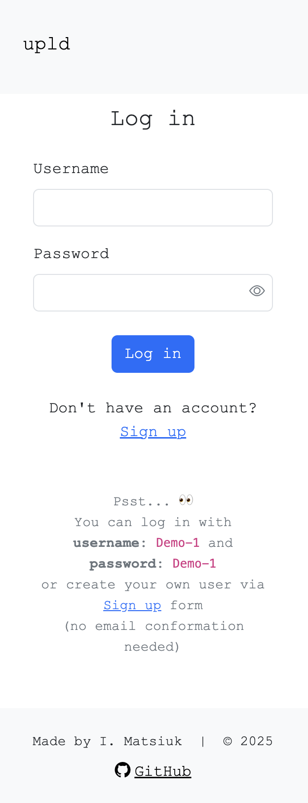
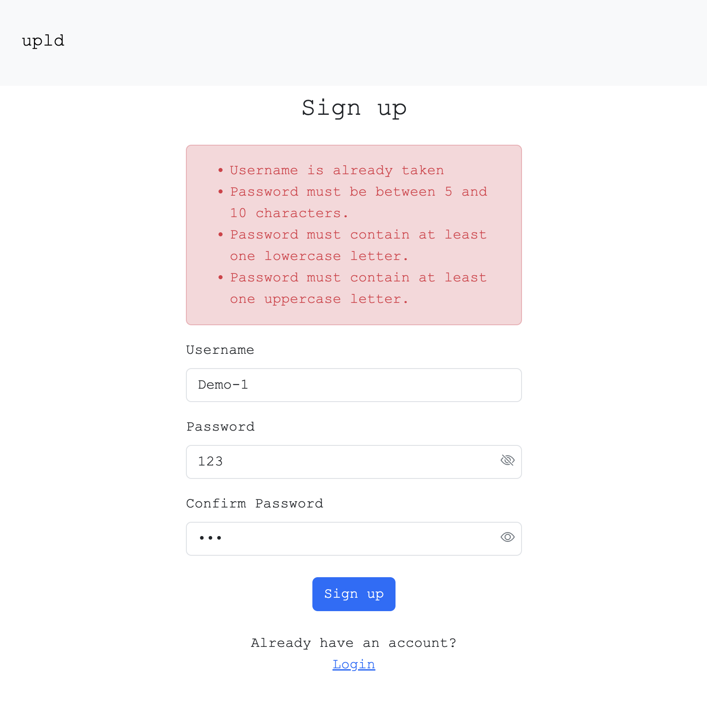
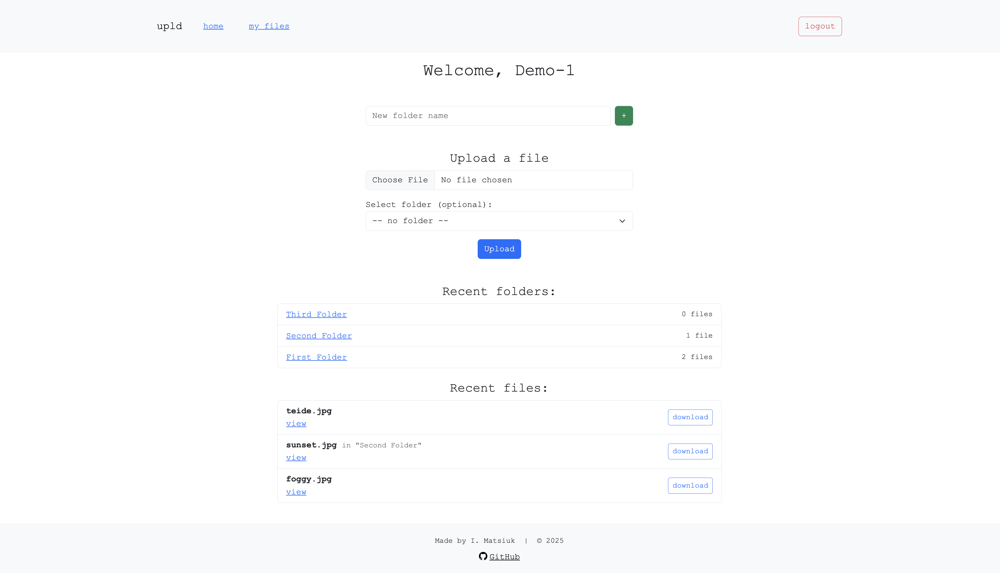
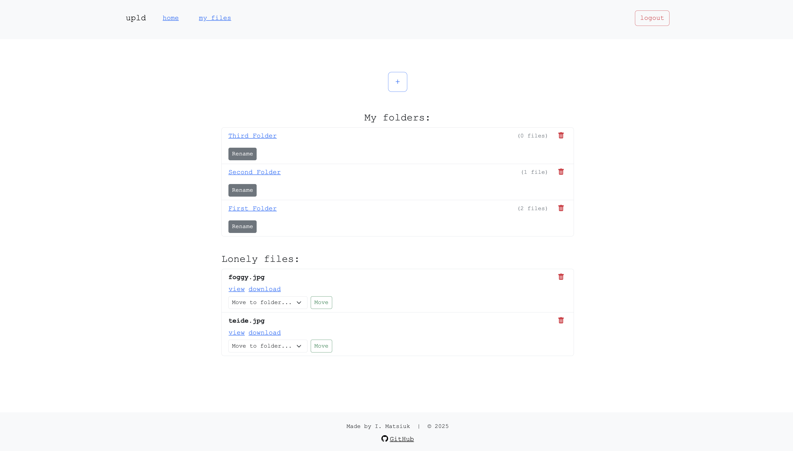

# Project: File Uploader App "upld"

### Curriculum: The Odin Project, Full Stack JavaScript path

### Course: NodeJS, chapter: "ORMs"

## Description:

**upld** is a full-stack file uploader app where users can register, create folders, and upload files using Supabase Storage. Built with Node.js, Express, and PostgreSQL, this is my first project practicing Prisma ORM for database management and modeling. The app features authentication, form validation, session handling, and a responsive Bootstrap UI.

Live: [upld](https://imatsiuk-fileuploader.onrender.com/)  
_Note: this app is deployed on [render.com](https://render.com/) and it may take up to 60 seconds to load the app.  
Thanks, for your patience_

---

## Features

- User authentication (sign up / log in / log out)
- Session management with express-session and Prisma session store
- Folder creation, renaming, deletion
- File uploads to Supabase Storage
- Public file URLs, download and preview support
- Organize files in folders or keep them standalone
- Bootstrap UI for responsive layout
- Validation feedback

---

## Demo Screenshots

#### Mobile: `Log in`, Tablet: `Sign up`, Desktop: `Home` and `My files`

---

## Tech Stack

**Backend:**

- [Node.js](https://nodejs.org/)
- [Express.js](https://expressjs.com/)
- [Prisma ORM](https://www.prisma.io/)
- [PostgreSQL](https://www.postgresql.org/) (via [Neon](https://neon.tech/))
- [Passport.js](http://www.passportjs.org/)
- [Express Validator](https://express-validator.github.io/)
- [dotenv](https://github.com/motdotla/dotenv)

**Frontend:**

- [Bootstrap 5](https://getbootstrap.com/) — for responsive UI
- [EJS](https://ejs.co/) — templating engine
- [Bootstrap Icons](https://icons.getbootstrap.com/)

**Hosting:**

- [Render](https://render.com/) — for deploying the Node.js server
- [Neon](https://neon.tech/) — cloud PostgreSQL database
- [Supabase](https://supabase.com/) — file storage

## Demo Login

To try the app without registering:  
username: `Demo-1`  
pass: `Demo-1`
